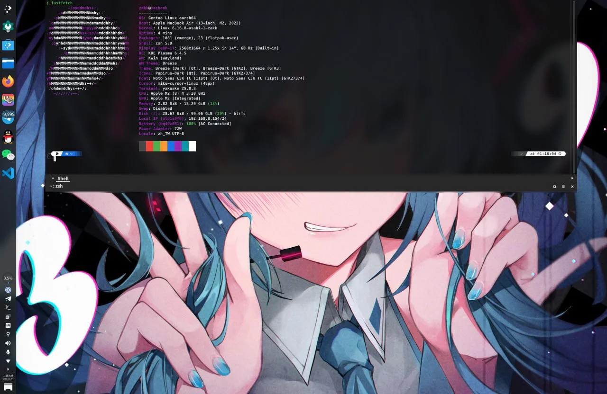

This article documents the complete process of installing native ARM64 Gentoo Linux on an Apple Silicon Mac (the M1/M2 series).

Thanks to the Asahi Linux team (especially [chadmed](https://github.com/chadmed/gentoo-asahi-releng)), Gentoo now has an [official Asahi installation guide](https://wiki.gentoo.org/wiki/Project:Asahi/Guide). This article builds on that guide and fills in details from actually doing it.

Hardware support (per the current Asahi [Feature Support](https://asahilinux.org/docs/platform/feature-support/overview/) status):

- M1, M2 (whole lineup): good enough for daily desktop use
- M3: GPU is a work in progress; Wi-Fi / audio and the rest are still TBA, not a good desktop yet
- M4: most of the core drivers are TBA, not usable for now
- M5: not on the official support table yet

This guide is for M1/M2. Last checked: May 29, 2026.

## Process Overview

Required steps:

1. Download the official Gentoo Asahi live USB image
2. Set up U-Boot via the Asahi installer
3. Boot from the live USB
4. Partition and mount the filesystem
5. Extract the Stage3 and chroot
6. Install the Asahi support package set
7. Reboot to finish the install

Optional steps: LUKS encryption, a custom kernel, PipeWire audio, a desktop environment.

When you're done you'll have a macOS + Gentoo Linux ARM64 dual-boot setup on the Mac.

## Prerequisites

### Hardware Requirements

- An Apple Silicon Mac (only M1/M2 work as a desktop; M3/M4 drivers are incomplete, and M5 isn't on the official support table yet)
- At least 80 GB of free disk space, 120 GB or more is better
- Stable Wi-Fi or Ethernet
- Back up anything you care about

### Known Working Status

Working: CPU, RAM, storage, Wi-Fi, keyboard, trackpad, power management, built-in and external displays, USB-C / Thunderbolt.

Partial support: GPU acceleration (OpenGL is partially supported).

Not working: Touch ID, macOS virtualization.

## 1. Prepare the Gentoo Asahi Live USB

### 1.1 Download the Image

Use Gentoo's own ARM64 live USB directly, no Fedora middleman needed:

```
https://chadmed.au/pub/gentoo/
```

Go with `install-arm64-asahi-latest.iso` (a stable symlink chadmed maintains), or pick a dated build so you can reproduce things later. If you hit boot problems, try the previous stable dated build.

### 1.2 Create the Bootable USB

On macOS:

```bash
diskutil list
diskutil unmountDisk /dev/disk4
sudo dd if=install-arm64-asahi-*.iso of=/dev/rdisk4 bs=4m status=progress
diskutil eject /dev/disk4
```

## 2. Set Up the Asahi U-Boot Environment

### 2.1 Run the Asahi Installer

In macOS Terminal:

```bash
curl https://alx.sh | sh
```

It's a good idea to open <https://alx.sh> and read the script before you pipe it into a shell.

### 2.2 Follow the Installer

1. Choose `r` (Resize an existing partition to make space for a new OS)
2. Allocate space for Linux (at least 80 GB recommended; you can enter a percentage or an absolute size)
3. Choose **UEFI environment only (m1n1 + U-Boot + ESP)**
4. Enter `Gentoo` as the OS name
5. Shut down as instructed

### 2.3 Complete the Recovery Setup

1. Wait 25 seconds to ensure a full shutdown
2. Hold the power button until "Loading startup options..." appears
3. Release the power button
4. Select Gentoo from the list of volumes
5. Enter macOS Recovery and enter your user password (FileVault)
6. Follow the prompts to finish setup

If you end up in a boot loop or get asked to reinstall macOS, hold the power button to shut down and start over; or boot into macOS, rerun `curl https://alx.sh | sh`, and choose `p` to retry.

## 3. Boot from the Live USB

Plug in the USB and power on; U-Boot boots GRUB from the USB on its own. If you need to point it there manually:

```
setenv boot_targets "usb"
setenv bootmeths "efi"
boot
```

Set up networking (the Gentoo live USB now uses NetworkManager, and nmtui is the quickest way):

```bash
nmtui                  # Select a Wi-Fi network or edit a wired connection
ping -c 3 1.1.1.1      # Verify connectivity by IP first (sidesteps DNS issues)
ping -c 3 www.gentoo.org   # Then test DNS
```

The Apple Silicon Wi-Fi driver is already in the kernel. If it's flaky, try a 2.4 GHz network.

Optionally enable SSH for remote operation (the live USB uses OpenRC):

```bash
passwd                 # Set the root password
rc-service sshd start  # Start SSH (OpenRC command)
ip a | grep inet       # Show the IP address
```

## 4. Partitioning and Filesystem

Leave the existing APFS container, EFI partition, and Recovery partition alone. Only work inside the space the Asahi installer set aside.

Inspect the partitions:

```bash
lsblk
blkid --label "EFI - GENTO"
```

A typical layout:

```
nvme0n1p1   500M    Apple Silicon boot
nvme0n1p2   307.3G  Apple APFS (macOS)
nvme0n1p3   2.3G    Apple APFS
nvme0n1p4   477M    EFI System  (do not touch)
(free)      ~150G   free space for Linux
nvme0n1p5   5G      Apple Silicon recovery
```

### 4.1 Create the Root Partition

Use `cfdisk /dev/nvme0n1` to create a Linux filesystem-type partition in the free space.

Without encryption:

```bash
mkfs.btrfs /dev/nvme0n1p6     # or mkfs.ext4
mount /dev/nvme0n1p6 /mnt/gentoo
```

With encryption (recommended):

```bash
cryptsetup luksFormat --type luks2 --pbkdf argon2id --hash sha512 --key-size 512 /dev/nvme0n1p6
cryptsetup luksOpen /dev/nvme0n1p6 gentoo-root
mkfs.btrfs --label root /dev/mapper/gentoo-root
mount /dev/mapper/gentoo-root /mnt/gentoo
```

What the parameters do: `argon2id` resists ASIC/GPU brute-forcing; `luks2` works with better security tooling; the M1 has the AES instruction set, so it can hardware-accelerate `aes-xts`.

### 4.2 Mount the EFI Partition

```bash
mkdir -p /mnt/gentoo/boot
mount /dev/nvme0n1p4 /mnt/gentoo/boot
```

## 5. Stage3 and chroot

From here you can follow the [AMD64 Handbook](https://wiki.gentoo.org/wiki/Handbook:AMD64) up to the kernel installation chapter.

### 5.1 Download and Extract the Stage3

`wget` doesn't do wildcards over HTTPS, so first grab the current Stage3 filename from the `latest-stage3-*.txt` index file, then download it and verify it with the Gentoo Release Engineering GPG public key:

```bash
cd /mnt/gentoo
BASE=https://distfiles.gentoo.org/releases/arm64/autobuilds

# 1. Get the latest Stage3 path from the official index
STAGE3=$(wget -qO- ${BASE}/latest-stage3-arm64-desktop-systemd.txt | grep -v '^#' | cut -d' ' -f1)

# 2. Download the tarball + signature
wget "${BASE}/${STAGE3}"
wget "${BASE}/${STAGE3}.asc"

# 3. Get the Gentoo Release Engineering signing public keys (needed the first time)
gpg --keyserver hkps://keys.gentoo.org --recv-keys 13EBBDBEDE7A12775DFDB1BABB572E0E2D182910 D99EAC7379A850BCE47DA5F29E6438C817072058

# 4. Verify the signature (you must see "Good signature from ...")
gpg --verify "$(basename ${STAGE3}).asc" "$(basename ${STAGE3})"

# 5. Extract (preserve attributes)
tar xpvf "$(basename ${STAGE3})" --xattrs-include='*.*' --numeric-owner
```

Or pick one by hand with the `links` text browser:

```bash
links https://distfiles.gentoo.org/releases/arm64/autobuilds/current-stage3-arm64-desktop-systemd/
```

### 5.2 Configure the Portage Repository

```bash
mkdir --parents /mnt/gentoo/etc/portage/repos.conf
cp /mnt/gentoo/usr/share/portage/config/repos.conf /mnt/gentoo/etc/portage/repos.conf/gentoo.conf
```

### 5.3 Sync the System Clock

```bash
chronyd -q
date
```

A wrong clock makes SSL certificate verification fail and emerge throw errors.

### 5.4 Mount and Enter the chroot

```bash
cp --dereference /etc/resolv.conf /mnt/gentoo/etc/
mount --types proc /proc /mnt/gentoo/proc
mount --rbind /sys /mnt/gentoo/sys
mount --make-rslave /mnt/gentoo/sys
mount --rbind /dev /mnt/gentoo/dev
mount --make-rslave /mnt/gentoo/dev
mount --bind /run /mnt/gentoo/run
mount --make-slave /mnt/gentoo/run

chroot /mnt/gentoo /bin/bash
source /etc/profile
export PS1="(chroot) ${PS1}"
```

### 5.5 Edit make.conf

```bash
nano -w /etc/portage/make.conf
```

```conf
CHOST="aarch64-unknown-linux-gnu"
COMMON_FLAGS="-march=armv8.5-a+fp16+simd+crypto+i8mm -mtune=native -O2 -pipe"
CFLAGS="${COMMON_FLAGS}"
CXXFLAGS="${COMMON_FLAGS}"
FCFLAGS="${COMMON_FLAGS}"
FFLAGS="${COMMON_FLAGS}"
RUSTFLAGS="-C target-cpu=native"
LC_MESSAGES=C
MAKEOPTS="-j4"
# The R2 mirror the Asahi community recommends; in mainland China switch to BFSU / USTC / Tsinghua, see /mirrorlist/
GENTOO_MIRRORS="https://gentoo.rgst.io/gentoo"
EMERGE_DEFAULT_OPTS="--jobs 3"
VIDEO_CARDS="asahi"
L10N="zh-CN zh-TW zh en"
```

Set `MAKEOPTS` to your core count. Keep a trailing newline at the end of the file.

```bash
emerge-webrsync
# Choose the time zone for your location: mainland China Asia/Shanghai, Taiwan Asia/Taipei, Hong Kong Asia/Hong_Kong
ln -sf /usr/share/zoneinfo/Asia/Shanghai /etc/localtime
```

Edit `/etc/locale.gen` to uncomment the locales you need, then:

```bash
locale-gen
eselect locale set en_US.utf8
env-update && source /etc/profile && export PS1="(chroot) ${PS1}"
```

Create a user:

```bash
useradd -m -G wheel,audio,video,usb,input <username>
passwd <username>
passwd root
```

## 6. Install the Asahi Support Package Set

This section stands in for the "Installing the kernel" chapter of the official Handbook.

### 6.1 Method A: Automated Script (Recommended)

```bash
emerge --sync
emerge --ask dev-vcs/git

cd /tmp
git clone https://github.com/chadmed/asahi-gentoosupport
cd asahi-gentoosupport
./install.sh
```

The script turns on the Asahi overlay, installs GRUB, sets `VIDEO_CARDS="asahi"`, installs `asahi-meta` (kernel, firmware, m1n1, and U-Boot), runs `asahi-fwupdate` and `update-m1n1`, then updates the system.

If you hit a USE flag conflict:

```bash
# Ctrl+C to interrupt the script
emerge --autounmask-write <conflicting-package>
etc-update              # Usually choose -3 to auto-merge
cd /tmp/asahi-gentoosupport && ./install.sh
```

Once the script finishes, skip to 6.3 to set up fstab.

### 6.2 Method B: Manual Install

Set up Portage and the Asahi overlay (synced via git):

```bash
emerge --sync
emerge --ask dev-vcs/git
rm -rf /var/db/repos/gentoo

sudo tee /etc/portage/repos.conf/gentoo.conf << 'EOF'
[DEFAULT]
main-repo = gentoo
[gentoo]
location = /var/db/repos/gentoo
sync-type = git
sync-uri = https://mirrors.bfsu.edu.cn/git/gentoo-portage.git
auto-sync = yes
sync-depth = 1
EOF

sudo tee /etc/portage/repos.conf/asahi.conf << 'EOF'
[asahi]
location = /var/db/repos/asahi
sync-type = git
sync-uri = https://github.com/chadmed/asahi-overlay.git
auto-sync = yes
EOF

emerge --sync
```

Simplified Chinese users can use the BFSU mirror `https://mirrors.bfsu.edu.cn/git/gentoo-portage.git`. For other mirrors, see the [mirror list](/mirrorlist/).

Keep the official dist-kernel from overriding the Asahi version:

```bash
mkdir -p /etc/portage/package.mask
cat > /etc/portage/package.mask/asahi << 'EOF'
virtual/dist-kernel::gentoo
EOF
```

Set up USE flags and VIDEO_CARDS:

```bash
mkdir -p /etc/portage/package.use
cat > /etc/portage/package.use/asahi << 'EOF'
dev-lang/rust-bin rustfmt rust-src
dev-lang/rust rustfmt rust-src
EOF
echo 'VIDEO_CARDS="asahi"' >> /etc/portage/make.conf
echo 'GRUB_PLATFORMS="efi-64"' >> /etc/portage/make.conf
```

Firmware license:

```bash
mkdir -p /etc/portage/package.license
echo 'sys-kernel/linux-firmware linux-fw-redistributable no-source-code' \
  > /etc/portage/package.license/firmware
```

Install:

```bash
emerge -q1 dev-lang/rust-bin
emerge -q sys-apps/asahi-meta virtual/dist-kernel:asahi sys-kernel/linux-firmware
```

Update the firmware and bootloader:

```bash
asahi-fwupdate
update-m1n1
```

You have to run `update-m1n1` after every kernel, U-Boot, or m1n1 update.

Install GRUB:

```bash
emerge -q grub:2
grub-install --boot-directory=/boot/ --efi-directory=/boot/ --removable
grub-mkconfig -o /boot/grub/grub.cfg
```

`--removable` is required so the system can boot from the ESP; `--boot-directory` and `--efi-directory` both point at `/boot/`; and `make.conf` must have `GRUB_PLATFORMS="efi-64"`.

Optionally, run `emerge --ask --update --deep --changed-use @world` to update the system.

### 6.3 Configure fstab

Get the partition UUIDs (adjust to your actual device paths):

```bash
# Root partition (unencrypted: use the device directly; encrypted: use the decrypted mapper device)
blkid /dev/nvme0n1p6                    # unencrypted
blkid /dev/mapper/gentoo-root           # encrypted

# EFI partition (the "EFI - GENTO" label set by the Asahi installer)
blkid --label "EFI - GENTO"

nano -w /etc/fstab
```

```fstab
UUID=<root-uuid>  /      btrfs  defaults  0 1
# If using ext4, change the third column to ext4
UUID=<boot-uuid>  /boot  vfat   defaults  0 2
```

### 6.4 Configure LUKS (Encrypted Users Only)

Enable systemd's cryptsetup support:

```bash
mkdir -p /etc/portage/package.use
echo "sys-apps/systemd cryptsetup" >> /etc/portage/package.use/fde
emerge --ask --oneshot sys-apps/systemd
```

Get the LUKS UUID (note this is the UUID of the encrypted container, not of the filesystem inside it):

```bash
blkid /dev/nvme0n1p6
```

Edit `/etc/default/grub`:

```conf
GRUB_CMDLINE_LINUX="rd.luks.name=<LUKS-UUID>=gentoo-root root=/dev/mapper/gentoo-root rootfstype=btrfs rd.luks.allow-discards"
```

- `rd.luks.name=<LUKS-UUID>=gentoo-root`: unlock using the LUKS container UUID (`blkid /dev/nvme0n1p6`) and name the mapper `gentoo-root`, to match crypttab / luksClose
- `root=/dev/mapper/gentoo-root`: the decrypted btrfs root (so you don't have to look up the filesystem UUID again)
- `rd.luks.allow-discards`: lets SSD TRIM pass through the encryption layer (a security trade-off)

dracut configuration:

```bash
emerge --ask sys-kernel/dracut

# Have dist-kernel updates automatically call dracut to rebuild the initramfs (recommended)
echo 'sys-kernel/installkernel dracut' > /etc/portage/package.use/installkernel
emerge --ask --oneshot sys-kernel/installkernel

nano -w /etc/dracut.conf.d/luks.conf
```

```conf
# Leave kernel_cmdline empty; GRUB's GRUB_CMDLINE_LINUX will override it
kernel_cmdline=""
# The crypt module pulls in cryptsetup automatically, no manual install_items needed
add_dracutmodules+=" btrfs systemd crypt dm "
filesystems+=" btrfs "
```

You can optionally write to `/etc/crypttab` so the system prompts for unlocking automatically:

```conf
gentoo-root UUID=<LUKS-UUID> none luks,discard
```

Generate the initramfs:

```bash
# Regenerate the initramfs for all installed kernels (recommended for dist-kernel:asahi)
dracut --force --regenerate-all

# Or target only the currently selected kernel:
# KVER=$(uname -r)   # Doesn't work inside the chroot, run it on the installed system
# dracut --force --kver "${KVER}"

grub-mkconfig -o /boot/grub/grub.cfg
grep initrd /boot/grub/grub.cfg
```

You have to redo this step after every kernel update. Installing `sys-apps/asahi-scripts` gives you an installkernel hook that handles it automatically.

## 7. Finishing Up and Rebooting

```bash
echo "macbook" > /etc/hostname
systemctl enable NetworkManager
passwd root
```

Exit the chroot and reboot:

```bash
exit
umount -R /mnt/gentoo
cryptsetup luksClose gentoo-root   # If using encryption
reboot
```

First boot order: U-Boot → GRUB (pick Gentoo) → (if encrypted) type the LUKS password → login prompt.

## 8. Post-Install Configuration

### 8.1 Networking

```bash
nmcli device wifi connect <SSID> password <password>
# Or the graphical interface
nmtui
```

### 8.2 Desktop Environment

First switch to a suitable profile (the numbers vary between systems, so go by the profile name):

```bash
eselect profile list
# Output looks something like:
#   default/linux/arm64/23.0/systemd
#   default/linux/arm64/23.0/desktop/gnome/systemd
#   default/linux/arm64/23.0/desktop/plasma/systemd
#   default/linux/arm64/23.0/desktop (generic, Xfce, etc.)
```

Pick the number that fits. The examples below (use the actual numbers from your own `eselect profile list`):

```bash
# Pick the number for the desktop/plasma/systemd line, for example:
eselect profile set default/linux/arm64/23.0/desktop/plasma/systemd
emerge -avuDN @world
```

KDE Plasma:

```bash
emerge --ask kde-plasma/plasma-meta kde-apps/kate kde-apps/dolphin
systemctl enable sddm
```

GNOME:

```bash
eselect profile set default/linux/arm64/23.0/desktop/gnome/systemd
emerge -avuDN @world
emerge --ask gnome-base/gnome gnome-extra/gnome-tweaks
systemctl enable gdm
```

Xfce:

```bash
eselect profile set default/linux/arm64/23.0/desktop
emerge -avuDN @world
emerge --ask xfce-base/xfce4-meta x11-misc/lightdm
systemctl enable lightdm
```

The first build of a desktop environment takes about 2–4 hours; stick to `--jobs 3` or fewer to avoid OOM.

### 8.3 Fonts and Chinese Input

```bash
emerge --ask media-fonts/liberation-fonts media-fonts/noto media-fonts/noto-cjk media-fonts/dejavu
eselect fontconfig enable 10-sub-pixel-rgb.conf
eselect fontconfig enable 11-lcdfilter-default.conf

emerge --ask app-i18n/fcitx-chinese-addons
```

In testing, `app-i18n/fcitx-rime` doesn't work right in the current version; use `fcitx-chinese-addons` instead.

### 8.4 Audio

```bash
emerge --ask media-libs/asahi-audio

# If PulseAudio is installed, stop it first to avoid conflicts
systemctl --user disable --now pulseaudio.socket pulseaudio.service 2>/dev/null

# Enable PipeWire (socket-activation; the pipewire daemon starts on demand)
systemctl --user enable --now pipewire-pulse.socket
systemctl --user enable --now wireplumber.service
```

## 9. System Maintenance

Update regularly:

```bash
emerge --sync             # Includes the Asahi overlay
# Or sync only the overlay
emaint sync -r asahi
emerge --ask --update --deep --newuse @world
emerge --ask --depclean   # Confirm the packages to be removed before running
dispatch-conf             # Handle .__cfg config changes
```

Mandatory after every kernel update:

```bash
update-m1n1
grub-mkconfig -o /boot/grub/grub.cfg
```

m1n1 Stage 2 holds the devicetree blobs the kernel needs to detect hardware. `sys-apps/asahi-scripts` provides an installkernel hook that can automate this.

macOS updates ship firmware updates with them, so keep the macOS partition around to pull the latest firmware.

## 10. Troubleshooting

**Can't boot from USB**: U-Boot's USB driver is picky. Try a different USB drive, a USB 2.0 device, or go through a USB hub.

**Boot hangs or black screen**: m1n1 / U-Boot / kernel versions don't match. Rerun `curl https://alx.sh | sh` from macOS and choose `p`, and make sure you ran `update-m1n1` inside the chroot.

**Encrypted partition won't unlock**: check `GRUB_CMDLINE_LINUX` in `/etc/default/grub`, double-check the LUKS UUID (`blkid /dev/nvme0n1p6`), and rerun `grub-mkconfig -o /boot/grub/grub.cfg`.

**Wi-Fi is unstable**: usually a WPA3 or 6 GHz band issue. Switch to WPA2, 2.4 GHz, or 5 GHz.

**Trackpad dead**:

```bash
dmesg | grep -i firmware
emerge --ask sys-apps/asahi-meta
```

## 11. Advanced Options

The notch: add this to the GRUB kernel parameters

```
appledrm.show_notch=1
```

(Before Asahi kernel 6.18 it was `apple_dcp.show_notch=1`; as of 6.18 the `apple_dcp` module got renamed to `appledrm`.)

In KDE Plasma you can add a full-width panel at the top and line its height up with the bottom of the notch.

Custom kernel:

```bash
emerge --ask sys-kernel/asahi-sources
cd /usr/src/linux
make menuconfig
make -j$(nproc)
make modules_install
make install
update-m1n1
grub-mkconfig -o /boot/grub/grub.cfg
```

Keep a working kernel around as a fallback.

Switching between kernels:

```bash
eselect kernel list
eselect kernel set <number>
update-m1n1
```

## References

- [Gentoo Wiki: Project:Asahi/Guide](https://wiki.gentoo.org/wiki/Project:Asahi/Guide)
- [Asahi Linux official site](https://asahilinux.org/)
- [Asahi Linux Feature Support](https://asahilinux.org/docs/platform/feature-support/overview/)
- [Gentoo AMD64 Handbook](https://wiki.gentoo.org/wiki/Handbook:AMD64)
- [asahi-gentoosupport](https://github.com/chadmed/asahi-gentoosupport)
- [Gentoo Asahi Releng](https://github.com/chadmed/gentoo-asahi-releng)
- [User:Jared/Gentoo On An M1 Mac](https://wiki.gentoo.org/wiki/User:Jared/Gentoo_On_An_M1_Mac)

Community support:

- Telegram group: [@gentoo_zh](https://t.me/gentoo_zh)
- Telegram channel: [@gentoocn](https://t.me/gentoocn)
- [GitHub](https://github.com/Gentoo-zh)
- [Gentoo Forums](https://forums.gentoo.org/)
- IRC `#gentoo` / `#asahi` @ [Libera.Chat](https://libera.chat/)
- [Asahi Linux Discord](https://discord.gg/asahi-linux)
